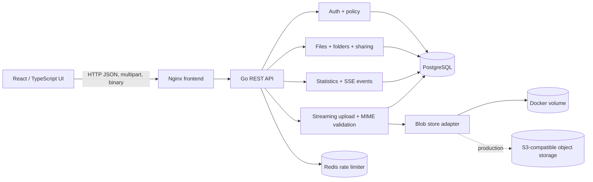
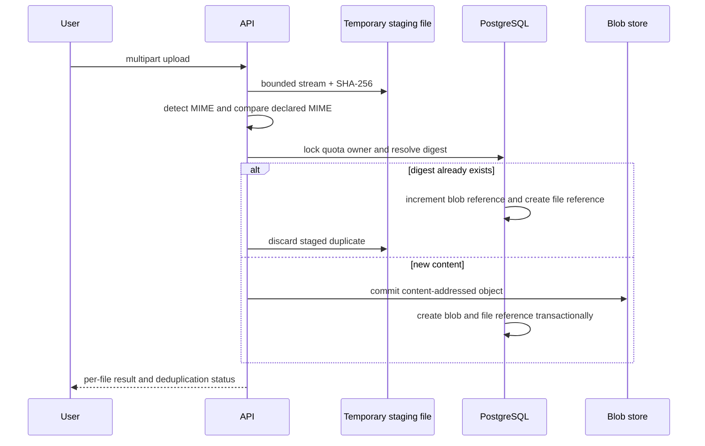
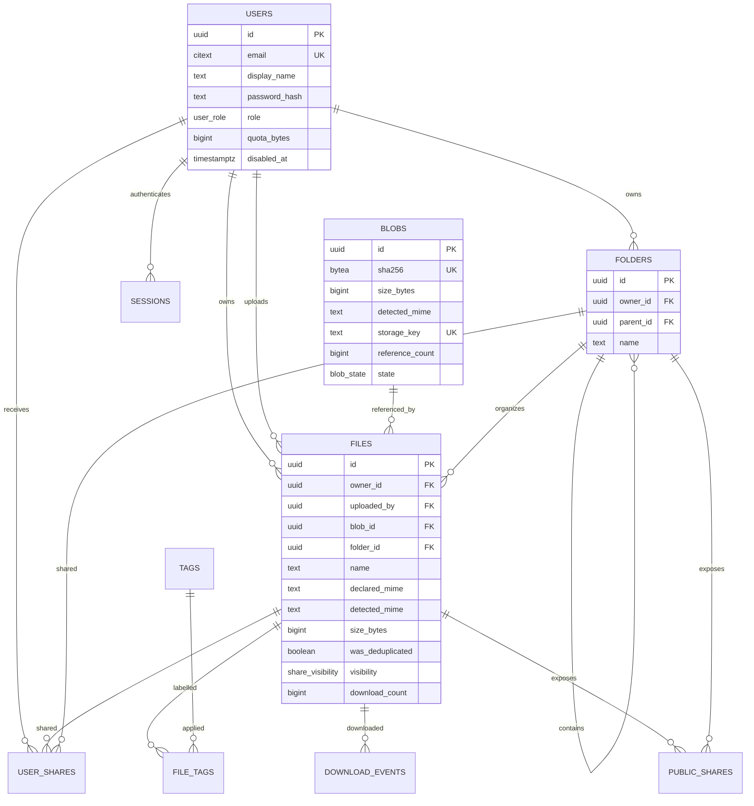

# File Vault — Engineering Documentation

> A secure, multi-user file-management system with content-addressed storage, deduplication, folders, sharing, quotas, search, analytics, and administrative oversight.

This is the consolidated project document for setup, architecture, data design, API behavior, implementation coverage, verification, deployment, and AI-assisted engineering methodology. It is intentionally self-contained so a reviewer can understand the system without opening a collection of issue notes.

## Contents

1. [Product scope](#1-product-scope)
2. [Quick start](#2-quick-start)
3. [Repository structure](#3-repository-structure)
4. [Architecture](#4-architecture)
5. [Database schema](#5-database-schema)
6. [Storage and deduplication](#6-storage-and-deduplication)
7. [Authentication and authorization](#7-authentication-and-authorization)
8. [API contract](#8-api-contract)
9. [Frontend behavior](#9-frontend-behavior)
10. [Requirements and deliverables](#10-requirements-and-deliverables)
11. [Testing and verification](#11-testing-and-verification)
12. [Configuration](#12-configuration)
13. [Deployment](#13-deployment)
14. [Production-readiness notes](#14-production-readiness-notes)
15. [AI-assisted engineering methodology](#15-ai-assisted-engineering-methodology)

## 1. Product scope

File Vault provides each authenticated user with an isolated private workspace. Users can upload one or many files, organize them into folders, search and filter their own files, inspect metadata, preview supported content, download content, share files or folders, revoke access, and monitor storage efficiency. Administrators have a separate oversight area for workspace-wide inventory, uploader details, downloads, uploads, sharing, and aggregate usage analytics.

The implementation uses REST at runtime. A GraphQL SDL draft is retained under `docs/contracts/graphql-schema.graphql` because the hiring brief identifies GraphQL as preferred while explicitly accepting REST.

## 2. Quick start

### Prerequisites

- Docker Desktop with Docker Engine running
- Git
- PowerShell 7 for the verification scripts
- Go 1.24+ and Node.js 22+ only when running services natively

### Recommended local startup

From the repository root:

```powershell
Copy-Item .env.example .env
docker compose config
docker compose up --build -d
docker compose ps
```

Open `http://localhost:5173`. Compose starts PostgreSQL, Redis, the Go API, and the Nginx-served React frontend. Database initialization and the local seed are idempotent.

### Backend-only setup

```powershell
cd backend
go mod download
go test ./...
go vet ./...
go run ./cmd/api
```

The API listens on `HTTP_ADDR` (default `:8080`) and requires a reachable PostgreSQL database. In production, Redis should also be configured for distributed rate limiting.

### Frontend-only setup

```powershell
cd frontend
npm ci
npm run lint
npm run build
npm run dev
```

The Vite development server is configured for the local API proxy. The production container builds the application and serves it through Nginx.

### Local accounts

The seed command creates local-only evaluation accounts from environment variables. Passwords are never stored in the repository:

```powershell
$env:SEED_ALICE_PASSWORD = "choose-a-local-password"
$env:SEED_BOB_PASSWORD = "choose-another-local-password"
$env:SEED_ADMIN_PASSWORD = "choose-an-admin-password"
cd backend
go run ./cmd/seed
```

The application also supports self-service registration. New users receive the default quota and a private vault; registration cannot create an administrator account.

## 3. Repository structure

```text
backend/                 Go REST API and domain services
  cmd/api/               API server
  cmd/seed/              idempotent local account seeding
  internal/auth/         sessions, Argon2id passwords, CSRF, RBAC
  internal/files/        metadata, folders, sharing, content, stats, admin
  internal/upload/       streaming upload, MIME validation, quotas
  internal/storage/      local and S3-compatible blob-store adapters
  internal/platform/     config, database, health, rate limiting
frontend/                React + TypeScript + Vite application
  src/                   vault, admin, sharing, analytics, design system
  tests/                 Playwright UAT
migrations/              forward-only PostgreSQL migrations
k8s/                     raw Kubernetes manifests
helm/balkanid/           Helm chart
docs/                    contracts, decisions, evidence, and this document
scripts/                 verification and core smoke scripts
tests/fixtures/          upload and MIME-validation fixtures
```

## 4. Architecture

The system is a modular monolith: domain boundaries remain explicit while metadata and blob-reference transactions stay close together. PostgreSQL owns relational state, Redis provides shared rate-limiter state when enabled, and a storage adapter keeps local development separate from production object storage.



### Upload lifecycle



## 5. Database schema

### Core entities



Migrations are forward-only and live in `migrations/000001_initial_schema.sql`, `000002_auth_sessions.sql`, and `000003_search_indexes.sql`. Ownership is explicit: `owner_id` determines the vault, quota, and deletion authority; `uploaded_by` preserves actor provenance for administrative uploads.

### Statistics semantics

- Original usage = `SUM(files.size_bytes)` for active files owned by the user.
- Deduplicated usage = the sum of distinct referenced blob sizes for that user.
- Savings bytes = original usage − deduplicated usage.
- Savings percentage = savings ÷ original usage × 100, or zero when original usage is zero.
- Quota enforcement compares logical original usage plus the incoming upload against `users.quota_bytes`.

## 6. Storage and deduplication

Uploads are streamed into a bounded temporary file while computing SHA-256. The user’s filename is metadata only and never becomes a filesystem path. The digest is the content identity.

For new content, the blob store receives one object under an opaque storage key and PostgreSQL creates one `blobs` row. For identical content, the existing blob is reused and only a new `files` reference is created; physical content is not duplicated. `reference_count` tracks how many logical file rows use the blob.

Deleting a file removes the logical reference in a transaction and decrements the reference count. A blob with zero references becomes eligible for safe garbage collection after commit. Foreign-key restrictions prevent physical content from being removed while references remain.

Local Docker uses a persistent volume. The adapter also supports S3-compatible storage for production, where shared object storage is required for multiple API replicas.

## 7. Authentication and authorization

- Email/password authentication uses Argon2id password hashes.
- Sessions are database-backed and delivered through HttpOnly cookies.
- CSRF tokens protect state-changing authenticated requests.
- Public shares use hashed opaque tokens and support revocation/expiry.
- Private files and folders are owner-scoped by default.
- Direct sharing supports view/download permissions and revocation.
- Only the uploader can delete a file; administrator visibility does not override this rule.
- Administrators can inspect the complete inventory, upload files, share files, view uploader details, download counts, and aggregate usage statistics.
- Unauthorized private resources are intentionally represented as not found where appropriate to avoid existence leaks.

## 8. API contract

All REST errors use a stable envelope:

```json
{
  "error": {
    "code": "QUOTA_EXCEEDED",
    "message": "Upload would exceed your configured quota.",
    "requestId": "req_01..."
  }
}
```

### Authentication

| Method | Path | Auth | Description |
|---|---|---|---|
| `POST` | `/api/auth/register` | None | Create a user account and start a session. |
| `POST` | `/api/auth/login` | None | Authenticate and start a session. |
| `POST` | `/api/auth/logout` | Session + CSRF | Revoke the current session. |
| `GET` | `/api/auth/me` | Session | Return the current user. |
| `GET` | `/api/auth/csrf` | Session | Return the CSRF token for the current session. |

### Files, uploads, folders, and sharing

| Method | Path | Auth | Description |
|---|---|---|---|
| `POST` | `/api/uploads` | Session + CSRF | Multipart single/multiple upload with per-file results. |
| `GET` | `/api/files` | Session | Owner-scoped list with filename, MIME, size, dates, tags, uploader, folder, and cursor filters. |
| `GET` | `/api/files/{id}` | Session | Detailed metadata and deduplication information. |
| `PATCH` | `/api/files/{id}` | Session + CSRF | Rename an owned file. |
| `DELETE` | `/api/files/{id}` | Session + CSRF | Delete only when the caller is the uploader. |
| `GET` | `/api/files/{id}/preview` | Session/share | Preview allowlisted content. |
| `GET` | `/api/files/{id}/content` | Session/share | Download authorized content and increment counters. |
| `GET` | `/api/folders` | Session | List owned child folders. |
| `POST` | `/api/folders` | Session + CSRF | Create an owned folder. |
| `PATCH` | `/api/folders/{id}` | Session + CSRF | Rename an owned folder. |
| `DELETE` | `/api/folders/{id}` | Session + CSRF | Delete an empty owned folder. |
| `PATCH` | `/api/files/{id}/folder` | Session + CSRF | Move an owned file to an owned folder or root. |
| `POST` | `/api/shares/public` | Session + CSRF | Create a public file or folder link. |
| `DELETE` | `/api/files/{id}/share` | Session + CSRF | Revoke a public file link. |
| `DELETE` | `/api/folders/{id}/share` | Session + CSRF | Revoke a public folder link. |
| `POST` | `/api/shares/direct` | Session + CSRF | Share a file/folder with a registered user. |
| `GET` | `/api/shares/{id}` | Session | List direct access entries. |
| `DELETE` | `/api/shares/direct/{id}` | Session + CSRF | Revoke direct access. |

### Search and filters

`GET /api/files` accepts combinable query parameters:

| Parameter | Meaning |
|---|---|
| `filename` | Partial filename search, backed by the PostgreSQL trigram index. |
| `mime` | Exact detected MIME type. |
| `minSizeBytes`, `maxSizeBytes` | Inclusive size range in bytes. |
| `uploadedAfter`, `uploadedBefore` | Upload timestamp range. |
| `tag` | Tag match. |
| `uploaderName` | Uploader display-name match. |
| `folderId` | Restrict results to a folder. |
| `first`, `after` | Bounded cursor pagination. |

Queries apply ownership scope before user filters, use parameterized SQL, and have supporting owner/time, owner/size, owner/MIME, folder, tag, and trigram indexes. Query-plan notes are in `docs/performance/search-plan.md`.

### Administration and operations

| Method | Path | Auth | Description |
|---|---|---|---|
| `GET` | `/api/admin/files` | Admin session | Workspace inventory with uploader details and download counts. |
| `GET` | `/api/admin/stats` | Admin session | Users, files, logical bytes, physical bytes, downloads. |
| `GET` | `/api/events/downloads` | Admin/owner session | Authorized SSE download updates. |
| `GET` | `/health/live` | None | Process liveness. |
| `GET` | `/health/ready` | None | Database, Redis, and storage readiness. |
| `GET` | `/public/{token}` | Public token | Preview/download landing page or shared-folder listing. |
| `GET` | `/public/{token}/download` | Public token | Public content stream; `preview=1` requests inline behavior. |

### Error codes

`UNAUTHENTICATED` (401), `FORBIDDEN` (403), `NOT_FOUND` (404), `INVALID_INPUT` (400), `INVALID_MIME` (415), `FILE_TOO_LARGE` (413), `QUOTA_EXCEEDED` (413), `RATE_LIMITED` (429), `CONFLICT` (409), `DEPENDENCY_UNAVAILABLE` (503), and `INTERNAL` (500). Rate-limit responses include `Retry-After`.

## 9. Frontend behavior

The React application provides:

- Sign-in and self-service registration.
- All files, folders, and recent uploads navigation.
- Single and multi-file picker upload.
- Global drag-and-drop prevention of browser navigation and routing into the same upload handler.
- MIME-type options, byte range, upload date range, tags, uploader, and filename search.
- Combined filters with clear-filter control.
- File detail panel with uploader, dates, declared/detected MIME, blob references, download count, move-to-folder, preview, sharing, and revoke actions.
- Folder context menu with open, rename, share, and delete.
- Multi-select deletion for owned files.
- Public and direct sharing with copy-link controls, permission selection, and access revocation.
- Inline PDF/image/media/text previews where safe, with download fallback.
- Per-user storage cards and visualizations for physical usage, original usage, savings, quota, and percentage saved.
- Dedicated administrator files/uploads and statistics/oversight sections.
- Responsive BalkanID-inspired design tokens applied consistently to typography, spacing, surfaces, controls, status indicators, charts, and dialogs.

## 10. Requirements and deliverables

### Required core features

| Requirement | Implementation |
|---|---|
| Authentication | Argon2id credentials, sessions, CSRF, registration, login/logout, RBAC. |
| Single/multiple uploads | Multipart upload handler with per-file success/rejection results. |
| MIME validation | Content sniffing and declared-vs-detected validation; forged extensions are rejected. |
| Deduplication | SHA-256 content identity, shared blob references, reference counts. |
| File listing/details | Owner-scoped list and metadata detail endpoint/UI. |
| Sharing | Private by default; public links; direct registered-user access; revoke controls. |
| Public counters | Authorized public downloads increment counters and emit events. |
| Strict deletion | Only the uploader may delete a file; other users/admins cannot. |
| Search/filtering | Filename, MIME, size, dates, tags, uploader; filters combine. |
| Rate limits | Configurable default 2 calls/second with burst control and Redis implementation. |
| Storage quota | Configurable default 10 MiB per user with clear 413 error. |
| Storage statistics | Physical, logical, savings bytes, savings percentage, quota visualization. |
| Admin panel | Inventory, uploader details, uploads/sharing, download counts, usage stats. |

### Bonus and delivery work

- Folder organization, nested-folder navigation, context menus, move, rename, and lifecycle rules.
- Inline preview for supported content types.
- SSE real-time download updates.
- Docker Compose with API, frontend, PostgreSQL, and Redis.
- GitHub Actions for formatting, `go vet`, Go tests, frontend lint/build, Playwright UAT, and Linux Docker image builds.
- GHCR image publishing on pushes to `master`.
- Kubernetes manifests for namespace, Deployments, Services, Ingress, ConfigMap, Secret reference, PostgreSQL, storage, probes, and PVCs.
- Helm chart under `helm/balkanid`.
- Search query-plan evidence and bounded cursor pagination.
- Consolidated engineering documentation and AI methodology.

Cloud deployment is prepared through the Kubernetes/Helm and Render plan, but an actual cloud release still requires provider resources, production secrets, managed PostgreSQL/Redis, object storage, DNS, and a domain decision.

## 11. Testing and verification

### Local verification

```powershell
./scripts/verify.ps1
cd backend; go test ./...; go vet ./...
cd ../frontend; npm ci; npm run lint; npm run build
```

### Core smoke suite

```powershell
pwsh -NoProfile -File scripts/core-smoke.ps1
```

The smoke suite covers valid upload, forged MIME rejection, SHA-256 reuse, metadata ownership, folders, statistics, public sharing/download, preview, authenticated download, and admin authorization.

### Browser UAT

```powershell
cd frontend
npx playwright install --with-deps chromium
npm run test:uat
```

The UAT checklist covers sign-in/out, uploads, MIME rejection, deduplication, search, folder management, sharing/revocation, previews/downloads, admin authorization, drag-and-drop behavior, and Compose health.

### CI pipeline

`.github/workflows/ci.yml` runs:

1. Go formatting check, `go vet`, and backend tests.
2. Frontend dependency install, ESLint, production build, and Playwright UAT.
3. Linux Docker image builds.
4. GHCR login/tag/push on `master` using the repository-provided `GITHUB_TOKEN`.
5. Optional manual Kubernetes deployment when `KUBE_CONFIG_B64` is configured.

## 12. Configuration

| Variable | Default | Purpose |
|---|---:|---|
| `APP_ENV` | `development` | Runtime environment. |
| `HTTP_ADDR` | `:8080` | API bind address. |
| `DATABASE_URL` | — | PostgreSQL connection string. |
| `REDIS_URL` | — | Required for shared production rate limiting. |
| `FRONTEND_ORIGIN` | `http://localhost:5173` | Allowed browser origin. |
| `SESSION_SECRET` | — | Strong session secret, at least 32 bytes. |
| `CSRF_SECRET` | — | Strong CSRF secret, at least 32 bytes. |
| `COOKIE_SECURE` | `false` | Set `true` behind HTTPS. |
| `API_RATE_PER_SECOND` | `2` | Per-user steady-state API rate. |
| `API_RATE_BURST` | `4` | Short burst allowance. |
| `USER_QUOTA_BYTES` | `10485760` | Default 10 MiB logical quota. |
| `MAX_FILE_BYTES` | `10485760` | Maximum individual file size. |
| `MAX_UPLOAD_BYTES` | `52428800` | Maximum multipart request size. |
| `BLOB_STORE_DRIVER` | `local` | `local` or `s3`. |
| `BLOB_STORE_PATH` | `/var/lib/balkanid/blobs` | Local blob root. |
| `PUBLIC_SHARE_BASE_URL` | `http://localhost:5173/share` | Generated-link base URL. |
| `LOG_LEVEL` | `info` | Structured logging level. |

Secrets belong in local environment files, CI secret storage, or an external secret manager—not in Git.

## 13. Deployment

### Docker Compose

```powershell
docker compose config
docker compose up --build -d
docker compose ps
docker compose logs --tail=100 api
```

Stop without deleting volumes:

```powershell
docker compose down
```

Use `docker compose down -v` only when intentionally discarding local database and blob data.

### Kubernetes and Helm

Raw manifests are under `k8s/`. The Helm chart is under `helm/balkanid/`:

```powershell
helm lint helm/balkanid
helm template file-vault helm/balkanid --namespace file-vault
helm upgrade --install file-vault helm/balkanid --namespace file-vault --create-namespace
```

Before deployment, replace placeholder image references and provide a real secret named by the manifests. A single-node evaluation cluster may use the included PostgreSQL/PVC resources; a production cluster should use managed PostgreSQL, Redis, and object storage.

### Cloud release checklist

1. Provision managed PostgreSQL and Redis.
2. Provision an S3-compatible bucket with lifecycle and backup policy.
3. Generate strong session/CSRF secrets and configure HTTPS origins.
4. Publish immutable API/frontend images to GHCR.
5. Configure Kubernetes Secret Manager integration or equivalent.
6. Apply Helm values for domain, ingress TLS, replicas, resources, probes, and image tags.
7. Run migrations, readiness checks, smoke tests, and restore verification.
8. Configure logs, metrics, alerts, rate-limit monitoring, backups, and spend limits.

## 14. Production-readiness notes

The codebase is production-minded and locally verified, but a real cloud launch still needs operational configuration outside the repository. In particular:

- Local blob storage must be replaced with shared object storage for multiple API replicas.
- The Redis-backed limiter must be enabled for multiple API replicas; the in-memory implementation is for local fallback only.
- Kubernetes Secret placeholders and example image names must be replaced by deployment-specific values.
- Managed database backups, restore drills, TLS, domain/DNS, observability, alerting, and cost controls must be configured by the deployment owner.
- Email verification, password recovery, abuse controls, malware scanning, and retention/legal policies are natural next production hardening steps if required by the launch environment.

These are explicit deployment responsibilities, not hidden assumptions in the implementation.

## 15. AI-assisted engineering methodology

AI was used as an engineering productivity aid for requirement decomposition, implementation proposals, test-case generation, security review, UI review, and documentation drafting. The process remained human-directed and evidence-based:

1. Translate the brief into dependency-ordered issues and acceptance criteria.
2. Give the assistant one bounded issue at a time with repository and security constraints.
3. Request the smallest reviewable change in the correct module.
4. Inspect the resulting diff and review authorization, transactional behavior, error handling, and data exposure.
5. Add focused tests for success, failure, authorization, boundaries, and concurrency.
6. Run deterministic checks: formatting, `go vet`, Go tests, frontend lint/build, UAT, smoke tests, database checks, and container health checks.
7. Update implementation documentation only when runtime evidence supports the claim.

No credentials, tokens, private files, or secret values are included in prompts or source control. AI output is treated as a proposal until reviewed and reproduced by the project’s own checks.

### Reusable professional prompt patterns

#### Requirement decomposition

```text
Review the product brief and convert it into dependency-ordered engineering issues. Classify each item as required, optional, bonus, or externally blocked. For each issue provide acceptance criteria, affected modules, security considerations, and a reproducible verification plan.
```

#### Secure backend implementation

```text
Implement this single issue in the existing Go module. Preserve centralized authorization, stable error codes, parameterized SQL, transaction semantics, configuration conventions, and existing API contracts. Add focused tests for success, failure, authorization, boundary, and concurrency behavior. Do not change unrelated modules.
```

#### Database and query review

```text
Review this schema or query for ownership leaks, race conditions, reference-count correctness, rollback behavior, pagination safety, and index usage. Propose the smallest forward-only migration or query change and include reproducible query-plan or benchmark evidence.
```

#### Frontend feature implementation

```text
Implement this user journey in the existing React/TypeScript design system. Cover loading, empty, error, success, keyboard, responsive, and authorization states. Keep API calls typed, preserve the product’s visual tokens, and add a Playwright journey for the highest-value behavior.
```

#### Security review

```text
Act as a security reviewer. Trace authentication, CSRF, authorization, file-path handling, MIME validation, token storage, headers, rate limiting, quota enforcement, and error disclosure. Report severity, evidence, exploit scenario, and the smallest remediation. Do not make unrelated changes.
```

#### Final evidence review

```text
Review the implementation against every acceptance criterion. Run focused tests followed by the full verification suite. Report exact commands and results, distinguish verified behavior from deployment prerequisites, and identify any documentation claim that exceeds the available evidence.
```

The diagrams in this document use Mermaid because it is text-based, version-controlled, and rendered natively by GitHub Markdown for flowcharts and entity-relationship diagrams. See the [Mermaid flowchart documentation](https://mermaid.js.org/syntax/flowchart) and [entity-relationship documentation](https://mermaid.js.org/syntax/entityRelationshipDiagram.html).

---

**Source of truth:** implementation under `backend/`, `frontend/`, `migrations/`, `k8s/`, and `helm/balkanid/`; verification under `scripts/` and `frontend/tests/`; supporting contracts under `docs/`.
